# Selenia Aroma

脳波アロマ測定サービスの事業者向け管理画面と、購入者向けアロマ記録画面をまとめた Next.js Web アプリです。利用者ごとのカルテ、1分測定の脳波画像、香りの制作履歴、μL / mL ベースの配合計算、ヒアリング回答、精油・ベースブレンド情報を一つの画面体系で扱います。

## まず画面を開く

下のリンクを押すだけで、すぐにデモ画面を確認できます。

### 事業者向けカルテを試す

**[アプリを起動する（脳波アロマ管理カルテ）](https://aroma-records-pwa.vercel.app/operator)**

この画面で、顧客を選ぶ、過去の制作履歴を選ぶ、脳波画像を見る、配合量を5mL / 10mLで切り替える、ヒアリング回答を見る、という一連の操作を確認できます。

### 購入者向け画面を試す

**[購入者向け画面を開く](https://aroma-records-pwa.vercel.app/dashboard)**

スマートフォン実機では、上のURLをそのままスマートフォンのブラウザで開いてください。PCでスマートフォン表示を試す場合は、ブラウザのデバイス表示を390×844程度にすると、実機に近い状態で確認できます。

詳しい操作手順は[非エンジニア向けデモ起動ガイド](docs/demo-start-guide.md)にまとめています。

## まず見る場所

| 用途 | URL / ファイル |
| --- | --- |
| 公開URL（現行記録） | [https://aroma-records-pwa.vercel.app/operator](https://aroma-records-pwa.vercel.app/operator) |
| ローカル起動 | `http://localhost:3000/operator` |
| 事業者向けカルテ画面 | `src/app/operator/page.tsx` |
| 購入者向けトップ | `src/app/dashboard/page.tsx` |
| 仕様書（Markdown） | `docs/aroma-operator-current-capability-spec.md` |
| 仕様書（Word） | `docs/aroma-operator-current-capability-spec.docx` |
| 仕様書（PDF） | `docs/aroma-operator-current-capability-spec.pdf` |
| 本番化仕様 | `docs/web-app-production-spec.md` |
| 精油カタログ | `docs/oil-catalog-database.md` |
| 内部ベースブレンド資料 | `docs/base-blend-recipes-internal.md` |
| 非エンジニア向けデモガイド | `docs/demo-start-guide.md` |

公開URLは現行デモの記録です。環境やVercelのデプロイ状態によって表示内容・認証状態が変わるため、共有前に`/operator`と`/dashboard`を確認してください。

## 現在の機能

- `/login`: ログインとロール別リダイレクト
- `/dashboard`: 購入者向けのアロマ記録ハブ
- `/aromas`: 制作済みアロマの一覧、検索・タブ表示
- `/aromas/[id]`: 配合概要、メモ、注意事項、再購入導線
- `/aromas/[id]/reorder`: 再購入前の確認画面
- `/moods` / `/moods/[mood]`: 目的・気分別の香り探索
- `/oils/[slug]`: 追加精油36種類の図鑑ページ
- `/base-blends` / `/base-blends/[id]`: ベースブレンド図鑑
- `/profile`: プロフィール、お気に入り、ログアウト
- `/admin`: 管理者ダッシュボード、顧客・制作記録の入口
- `/operator`: 脳波画像、複数回の診断・制作履歴、ヒアリング回答、配合記録を紐づける事業者向けカルテ

### 事業者向けカルテの要点

- 顧客8名のデモデータと、それぞれ複数回の診断・制作履歴
- 履歴選択に応じて、脳波画像、配合レシピ、完成量、追加精油、ヒアリング回答を切り替え
- 脳波画像のタイトル表示、拡大確認、アップロード想定（画像上限10MB）
- 総量を5mL / 10mLなどで指定し、各材料を比率から自動換算
- 単位をμL / mLで切り替え
- ベースブレンドの内部比率は通常画面に表示せず、管理者解除後だけ表示
- 妊娠、妊活、出産直後、服薬などの禁忌・注意フラグをヒアリング結果に保持

## ローカル起動

Node.js 22系で確認しています。

```powershell
npm install
npm run dev
```

この環境でnpmがPATHにない場合は、プロジェクト内の実行ファイルを使います。

```powershell
.\\.tools\\node-v22.16.0-win-x64\\npm.cmd run dev
```

起動後:

- `http://localhost:3000/login`
- `http://localhost:3000/operator`
- `http://localhost:3000/dashboard`

ビルドとLint:

```powershell
npm run lint
npm run build
```

## 環境変数とデモモード

`.env.local`に設定します。`.env.local`はGitHubへコミットしません。

```env
NEXT_PUBLIC_SUPABASE_URL=your-project-url
NEXT_PUBLIC_SUPABASE_ANON_KEY=your-anon-key
NEXT_PUBLIC_ENABLE_DEMO_MODE=false
NEXT_PUBLIC_APP_TARGET=all
```

現行版は画面検証用のモックデータとブラウザ内stateを中心に動きます。Supabaseの本番接続、永続DB、画像ストレージ、正式な認証・権限管理は未完成部分があります。詳細は[現行仕様書](docs/aroma-operator-current-capability-spec.md)と[本番化仕様](docs/web-app-production-spec.md)を参照してください。

## 画面キャプチャ

GitHub上で主要画面の見た目を確認できます。

<details>
<summary>購入者向け画面</summary>

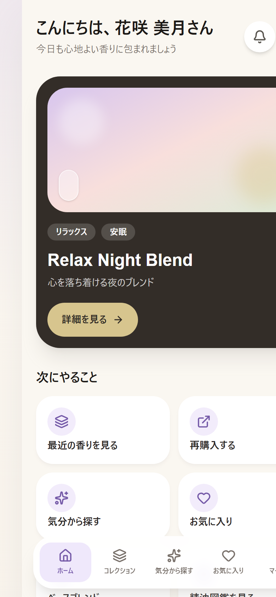
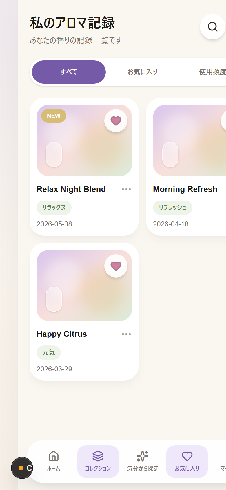
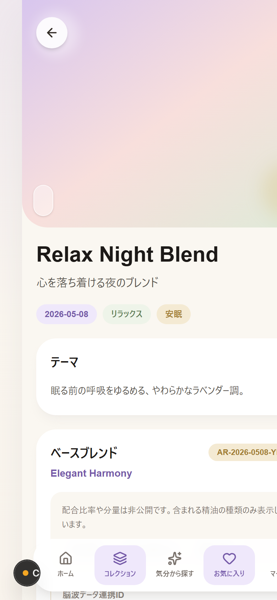
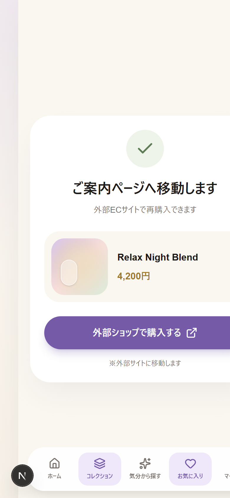
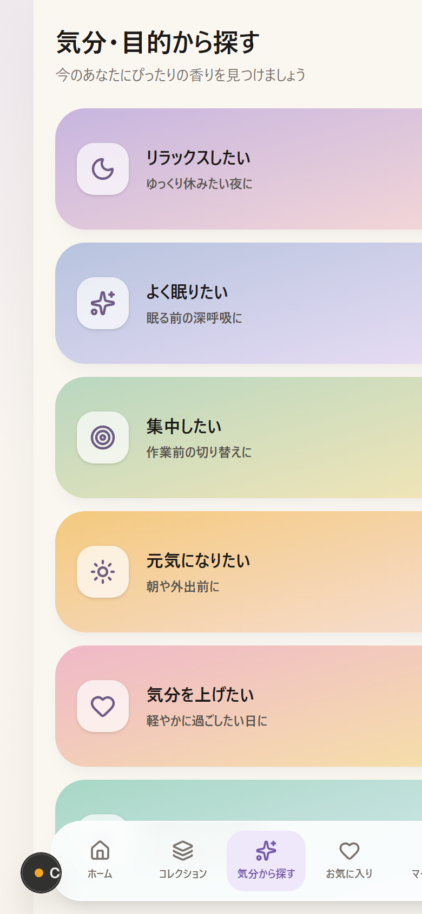
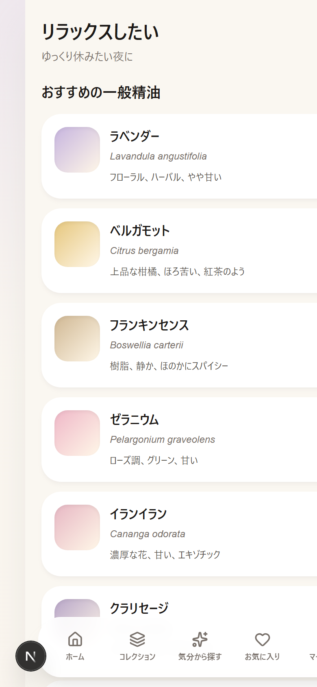
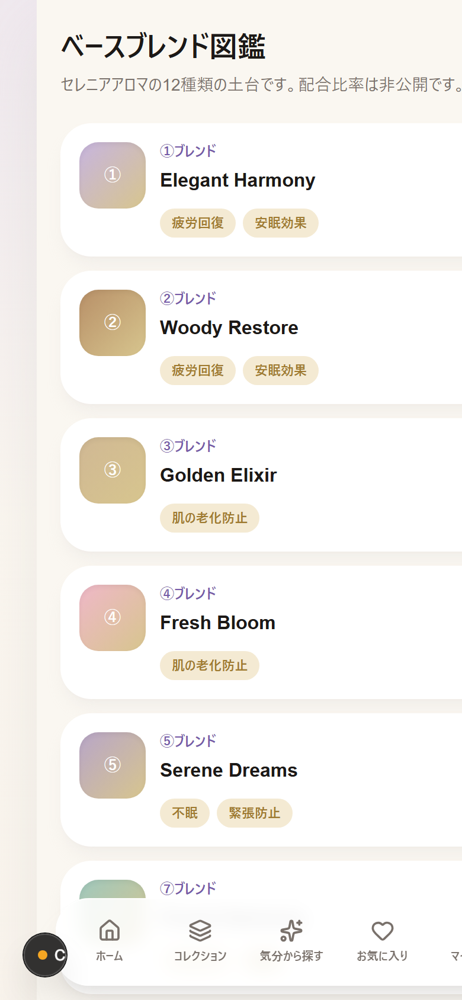
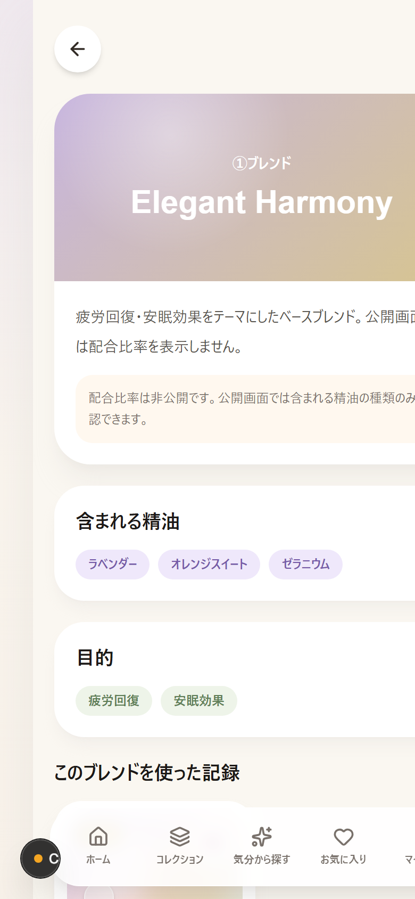
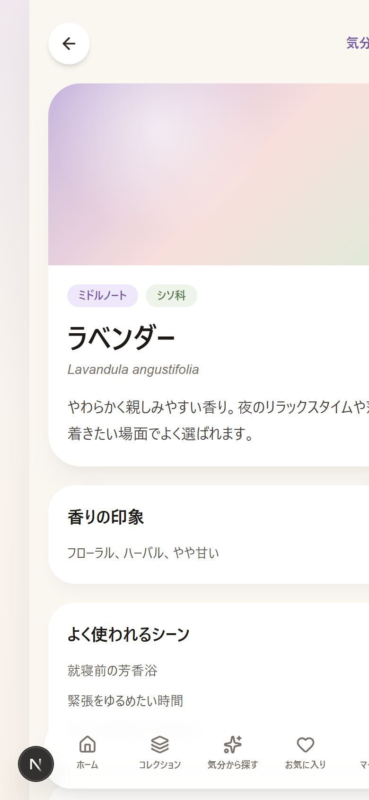
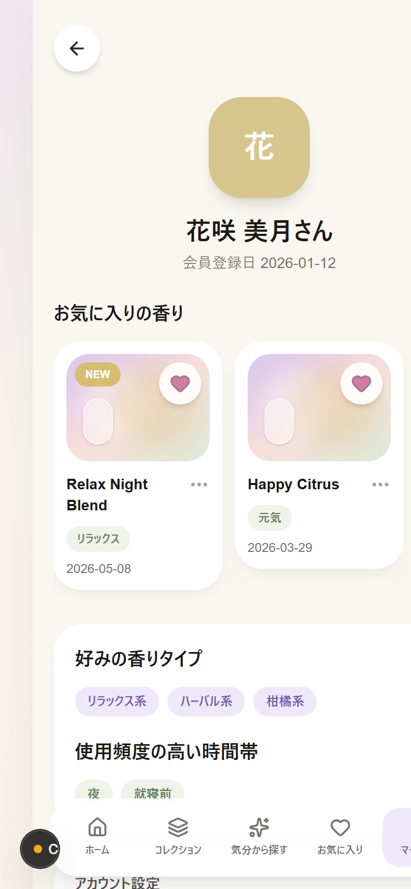

</details>

### 事業者向けカルテ（スマートフォン表示）

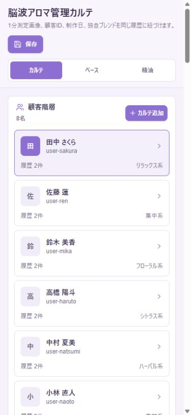

## 更新履歴

以下は、既存の仕様書・実装・生成済み画面資料から再構成した開発マイルストーンです。Gitのコミット履歴とは別に、機能が増えた順番を把握するための一覧です。

### 2026-07-07: 事業者向けカルテの現行デモを整理

- 顧客カルテを8名のデモ利用者と複数回の制作履歴で構成
- 過去履歴の選択に連動して、脳波画像・配合・制作量・ヒアリング回答を切り替え
- 総量を基準にしたμL / mL配合計算へ整理
- Googleフォーム回答を想定したヒアリング項目と禁忌・注意フラグを追加
- ベースブレンド内部情報の管理者限定表示を整理
- 10MB画像アップロード想定、画像タイトル、拡大確認の仕様を整理

### 2026-07-30: 仕様書・画面資料を出力

- 現行アプリ仕様書をMarkdown、Word、PDFで出力
- 購入者向け主要画面のスクリーンショットを`output/screenshots/customer`に整理
- 本番化に向けた認証、DB、Storage、脳波測定データ受信の拡張ポイントを文書化

### 2026-08-16: GitHub共同開発用に整理

- リポジトリの入口としてREADMEを整備
- 公開URL、ローカル起動、画面一覧、仕様書、画面キャプチャを相互リンク
- Codex、Claude、GLMなど複数の開発エージェントが参照できる共同開発ルールを追加
- 一時生成物、環境変数、ブラウザプロファイルをGit管理対象から除外

## ディレクトリ構成

```text
src/
  app/          画面とルート
  components/   共通UI
  data/         モックデータと精油カタログ
  hooks/        認証・プロフィール・記録・お気に入りのhooks
  lib/          Supabase、認証、ルート補助
  services/     データアクセス境界
  types/        DB・プロフィール・アロマ型
supabase/
  schema.sql    テーブル定義とRLSのたたき台
docs/
  *.md          現行仕様、精油、ベースブレンド、本番化資料
  *.docx/*.pdf  共有用の仕様書
output/
  screenshots/  画面キャプチャ
  docx/         生成済み仕様書
  pdf/          生成済みPDF
```

## 共同開発ルール

Codex、Claude、GLMなど別のエージェントで作業するときは、最初にこのREADMEと`docs/aroma-operator-current-capability-spec.md`を読み、担当範囲をIssueまたはブランチ名に残してください。

1. `main`へ直接コミットせず、`agent/<feature>`または`feature/<feature>`ブランチを使う
2. 変更前に`git status`を確認し、他の作業者の変更を上書きしない
3. UI変更は対象ルートと画面キャプチャをPR本文に書く
4. `npm run lint`と`npm run build`を実行し、失敗理由があればPR本文に残す
5. 実顧客データ、脳波画像、`.env.local`、管理者パスワード、内部配合比率を公開コミットしない
6. 配合計算や履歴切替など共有状態に関わる変更は、対象データと再現手順を記載する
7. 仕様書を変更した場合はMarkdownを正本とし、Word/PDFがある場合は再生成する

詳細は[共同開発ガイド](docs/repository-collaboration.md)を参照してください。

## Supabase接続

1. Supabaseプロジェクトを作成
2. SQL Editorで`supabase/schema.sql`を実行
3. Storageに`aroma-images` bucketを作成
4. Authのメール/パスワードログインを有効化
5. `profiles.role`に`customer`または`admin`を設定

本番公開ではデモモードを無効化し、管理者パスワードや内部比率をクライアントコードへ埋め込まない構成へ移行してください。
